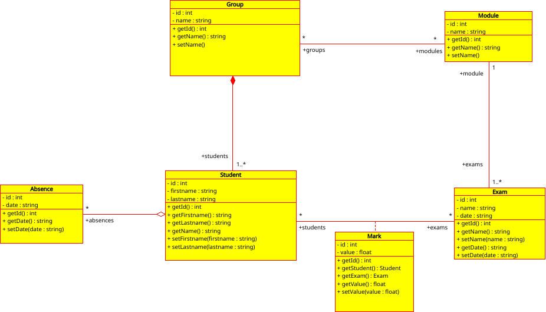

# Projet JAVA - Joris MARTIN

Application de gestion des étudiants.

- Création / Modification / Suppression :
  - Groupes
  - Étudiant
  - Absences
  - Modules
  - Examens
  - Notes

- Diagramme de classe de la persistance de données

- Code de certains tests (pas tous réaliser par manque de temps)